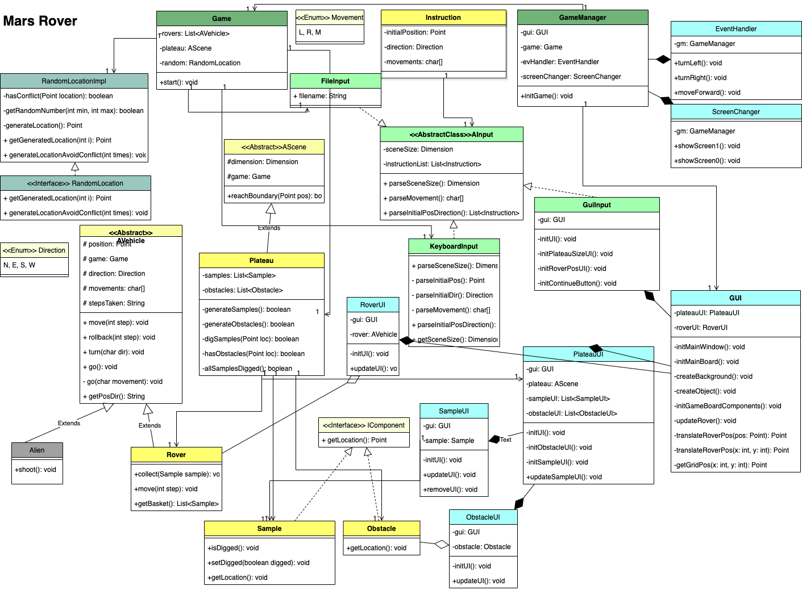

# mars-rover

## Key features

## Assumptions

## UML diagram
## Class Diagram:

## Approaches
1. Implement simple logic by getting Input from files
2. Add boundary check
3. Implement logic by getting user input
4. Implement GUI

## Future thoughts
1. input.GUI
2. Collect Sample
3. Support other vehicles
4. Add obstacle
5. Add Aliens

## Copyright
<a href="https://www.vecteezy.com/free-vector/mars-surface">Mars Surface Vectors by Vecteezy</a>

<a href="https://www.flaticon.com/free-icons/mars-rover" title="mars-rover icons">Mars-rover icons created by Eucalyp - Flaticon</a>

<a href="https://pixabay.com/vectors/arrow-go-icon-icons-matt-next-1294468/">Arrow image by Pixabay </a>