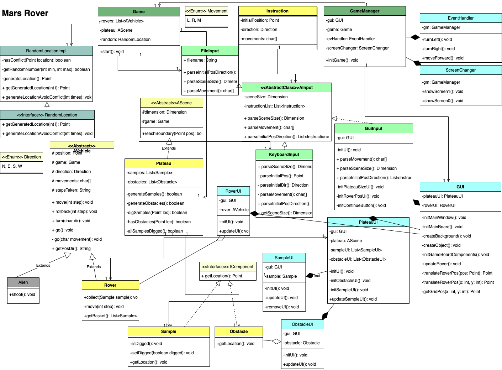

# mars-rover

## Key features

## Assumptions

## UML diagram
## Class Diagram:

## Key Feature:
The program support 3 types of user controller, i.e.
File controller, Keyboard controller, GUI controller.
Only file controller flow support multiple rovers. Keyboard/GUI controller support one rover only.

## Assumptions
File controller:

1. There will be 1 row at the top to indicate the screen size.
2. And then 1 row for specifying each rover init location and direction. 
Init location x, y are integers and should be within the plateau. And direction accepts N,E,S,W only.
3. And then 1 row for specifying each rover movements. It accepts a line of L,R,M combination only.
4. 2,3 will be repeated if there are more rovers
5. The program will calculate the final location of rover and display.
6. If the rover hit the boundary, the program will throw exception and halt.
7. If the rover hit the obstacles, the program will throw exception and halt.
8. If the rover enter the box with samples, rover will collect the samples, the count will be shown.

For Keyboard Input:
1. First, the text view will ask for plateau width and height. They must be integers. 
2. Second, the text view will ask for rover initial position. They must be integers too and should be within the plateau.
3. Thirdly, the text view will ask for rover initial direction. Direction must be N,E,S,W.
4. If any of the above controller not valid, the program will halt. 
5. The program will calculate the final location of rover and display.
6. If the rover hit the boundary, the program will throw exception and halt.
7. If the rover hit the obstacles, the program will throw exception and halt.
8. If the rover enter the box with samples, rover will collect the samples, the count will be shown.

For GUI controller:
Since the screen is limited to 800x500, the plateau size can only support up to 15x9.
1. First screen show a parameter request form to ask for plateau size and initial position / direction of rover.
2. Validation of plateau size are 15x9.  
3. Validation of rover initial position x and y are integers and within the plateau size.
4. Validation of rover direction must be N,E,S,W
5. User needs to right click on the rover to control its move.
6. If the rover hit the boundary, the program will show error message. User can give instruction again.
7. If the rover hit the obstacles, the program will show error message. User can give instruction again.
8. If the rover enter the box with samples, rover will collect the samples, the count will be shown in the message box.

## Approaches
1. Implement simple logic by getting Input from files
2. Add boundary check
3. Implement logic by getting user controller
4. Implement GUI in swing
5. Validate user controller
6. Add obstacle to block the way of rover
7. Add sample for rover to collect

## Future thoughts
1. Randomize the location of samples and obstacles
2. Implement GUI in Java FX
3. To support sizeable screen and sizeable image. So the gui plateau size does not bound to be 15x9.
4. Add background music, eg. star war music?!
5. Add feature to allow user to choose other vehicles, eg. flying scotsman
6. Add aliens to catch the rover, if rover is caught, then game over.

## Copyright
<a href="https://www.vecteezy.com/free-vector/mars-surface">Mars Surface Vectors by Vecteezy</a>
<a href="https://www.flaticon.com/free-icons/rock" title="rock icons">Rock icons created by Freepik - Flaticon</a>
<a href="https://www.flaticon.com/free-icons/mars-rover" title="mars-rover icons">Mars-rover icons created by Eucalyp - Flaticon</a>
<a href="https://www.flaticon.com/free-icons/mineral" title="mineral icons">Mineral icons created by Freepik - Flaticon</a>
<a href="https://pixabay.com/vectors/arrow-go-icon-icons-matt-next-1294468/">Arrow image by Pixabay </a>